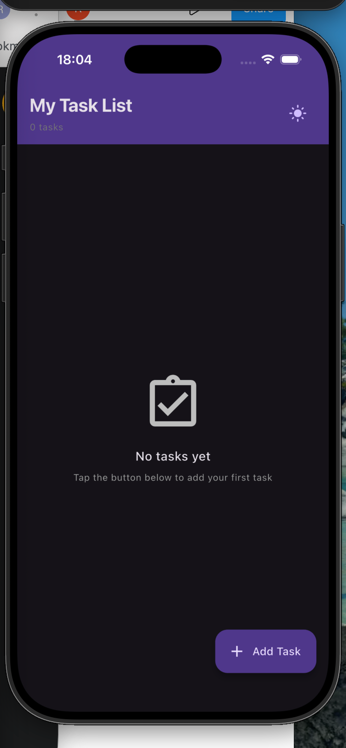
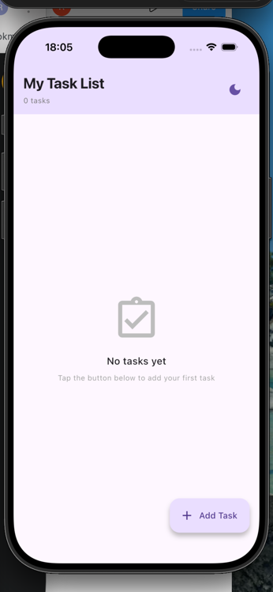
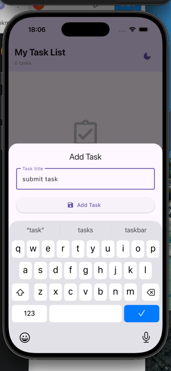
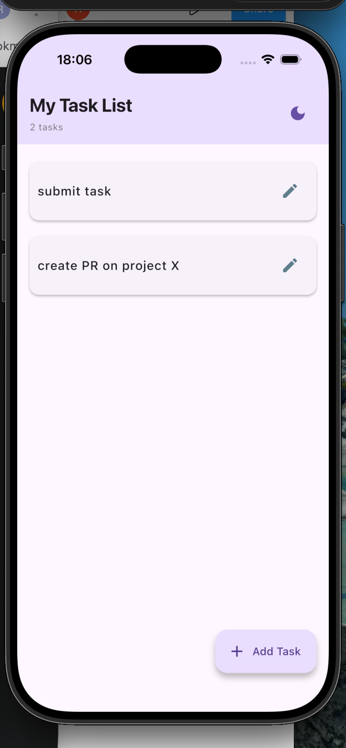
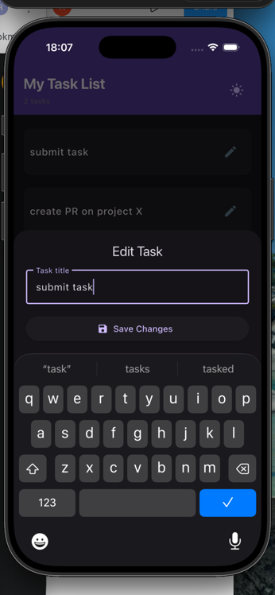

# Task Manager App

This project is a simple Task Management application

It allows users to perform basic CRUD (Create, Read, Update, Delete) operations on a list of tasks, featuring persistent local storage and a clean, modern UI.

## Key Features 

    - Create: the users can add new tasks 
    - Read: the users can see all active tasks in the home screen
    - Edit: the users can tap a task to modify its details 
    - Delete: the users can swipe to delete a task from the list
    - State persistence: all states are saved locally
    - Light/Dark theme toggleability 

## Technical Architecture
1. State Management: Cubit
2. Data persistence: Hive

## Images

